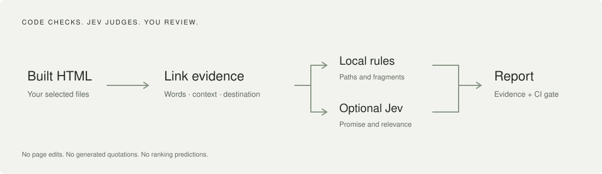

# AnchorLint

**A link can work and still send readers to the wrong place.**

[](https://github.com/prantikmedhi/anchorlint/actions/workflows/ci.yml)
[](LICENSE)



AnchorLint audits internal links in **built HTML sites and JSON inventories**. Ordinary code checks destinations, fragments and anchor hygiene. An optional [TypeSafe Jev](https://docs.typesafe.ai/introduction) pass checks whether an anchor's promise matches the destination and whether that destination fits its source context.

Every finding keeps its source, destination, anchor and surrounding text. The tool never rewrites pages, inserts links, or makes changes to your website.

[Install](docs/installation.md) · [Agent guide](docs/agent-guide.md) · [CI and baselines](docs/ci.md) · [How Jev works](docs/jev.md) · [Research](docs/research.md) · [Verification & limits](docs/verification.md)

## Quickstart — no API key

Python 3.11 or newer. Install directly from this repository; **not published on PyPI**:

```sh
python -m pip install "https://github.com/prantikmedhi/anchorlint/archive/refs/heads/main.zip"
anchorlint --help
anchorlint audit ./dist --base-url https://example.com --format html --output audit.html
```

Use your static site's actual output directory (`dist`, `out`, `_site`, or equivalent). Build your site first. AnchorLint does not execute JavaScript or fetch missing pages. For reproducible installation, replace `main` in the archive URL with a reviewed commit or release tag.

Run the included demonstration after downloading the repository:

```sh
anchorlint audit examples/site --base-url https://example.com --format json --output audit.json
```

The demonstration deliberately contains bad links. A nonzero findings exit is expected; it is not a failed installation. Generated results are from these labeled fixtures, not a customer's site.

## Optional semantic audit with Jev

Set `TYPESAFE_API_KEY` securely in your shell or CI secret store, then explicitly opt in:

```sh
anchorlint audit ./dist --base-url https://example.com   --provider jev --max-links 25 --model jev-1.13.0   --format json --output audit.json
```

This sends bounded link context and destination excerpts to **api.typesafe.ai** and may incur provider charges. No other model or proxy is used. No key is required in rules mode. The tool does not load `.env` files automatically.

Jev returns two probabilities and a bounded label. AnchorLint combines them in code and sends ambiguous cases to review. High confidence is not proof of correctness. There is no invented explanation, ranking forecast, Google score, or automatic fix.

## What this does — and does not do

| Capability | Scope |
|---|---|
| Internal target and fragment checks | Local built HTML or supplied inventory |
| Anchor/context evidence | Extracted text, not generated quotations |
| Semantic promise and relevance | Explicit Jev opt-in; heuristic human-review signals |
| Reports | JSON, Markdown, standalone escaped HTML |
| Regression gate | Stable finding fingerprints and JSON baseline |
| Agent integration | CLI + JSON contract; portable skill included |
| Live crawling, SERP/rank tracking, CMS edits | Not included |
| Full accessibility certification | Not included |
| Open-source model weights | Not included; this tool is MIT, Jev is a hosted dependency |

## Exit codes

- **0:** requested checks complete; no new finding reaches the chosen gate.
- **1:** new findings meet `--fail-on` (`error` by default, or `warning`).
- **2:** invalid input, operational/provider error, or incomplete semantic coverage. A baseline or `--fail-on never` cannot hide these.

`--max-links` is a paid-call limit, not permission to silently report unaudited links as clean. Read coverage, errors and review findings in every report. See [CLI reference](docs/cli.md) and [limits](SECURITY.md).

## Why another link tool?

Traditional broken-link checking asks whether a destination exists. Graph tools help inspect site structure; generative linkers propose or insert links. AnchorLint asks a smaller question: **does this existing link mean what it says?**

It complements these tools rather than claiming to replace them. The [research note](docs/research.md) explains the comparisons, Jev's limitations, and the evidence behind the project choice. SEO gains are not measured or guaranteed.

## Development

```sh
python -m venv .venv
# Activate the environment for your shell.
python -m pip install -e '.[dev]'
python -m unittest discover -s tests -v
ruff check src tests
python -m build
python scripts/check_docs.py
```

Start with [AGENTS.md](AGENTS.md), [PRD.md](PRD.md), and [ARCHITECTURE.md](ARCHITECTURE.md). Review [SECURITY.md](SECURITY.md) before processing unpublished or customer material.
